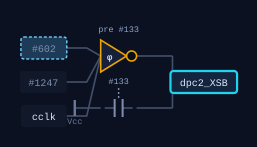
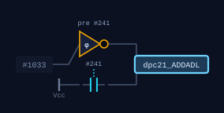
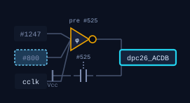
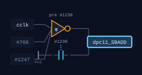
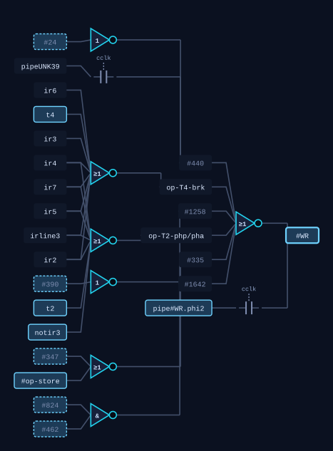

# Snake, one instruction deep

*Part one of a series on writing a game for a chip you can see inside.*

Generated by `tools/export-walk.py`. Every number below was measured by
running the real Snake ROM on the simulation; every schematic was pulled
from the live schematic page, which drew it from the switch network. If
something here is wrong, the chip changed.

---

## Before we start: four things worth having straight

### RAM and ROM, and why this console has only one of them

**ROM** is memory that was fixed when the part was made: the program is in
the silicon and cannot change. **RAM** forgets when the power goes, and
anything can write it.

A 6502 cannot tell them apart. It puts an address on sixteen pins and either
reads a byte or writes one; whether something out there is willing to be
written is not the processor's business. **On this console it is all RAM.**
`snake.rom` is 351 bytes that get loaded into memory starting at `$0200`, and
the chip fetches its first instruction there because the reset vector was
pointed at it. Nothing stops the program overwriting itself. That is not a
simplification of a real machine; it is what a real machine does when you
wire RAM where the ROM would go.

Snake's memory is in three parts, and you can read them straight off the
listing: **`$0000-$00FF` zero page** for its variables (cheaper to address,
one byte instead of two), **`$0100-$01FF` the stack**, which the hardware
insists on, and **`$0400` onward the screen**, which is a page of memory the
host happens to be drawing.

### Gates, dynamic nodes, and paths

Three words that mean something specific here.

A **gate** is a few transistors that compute a value and drive a wire to it.
This chip builds them one way only: a pull-up holds the wire high and a
network of transistors to ground can beat it, so the output is low when the
network conducts. **There is no AND gate and no OR gate on this die.**

A **dynamic** node is a wire that nothing drives. It is charged up by the
clock and then either pulled down or left alone, and it *remembers* by
holding that charge. It is the cheapest memory there is and it leaks, which
is why this processor has a minimum clock speed as well as a maximum: **stop
a 6502 for too long and it forgets what it was doing.**

A **path** is a pass transistor: one transistor with a control wire on its
gate, joining two wires when the control goes high. It does not compute
anything and it has no direction. Almost everything that looks like moving
data around in this chip is a path opening.

`docs/idioms.md` has the counts for all three.

### Addresses: how to say where something is

Every wire, transistor and connection on this die has one address, and it
reads back to front like a postcode:

```
  regs:x : bus : #1169
  \____/   \_/    \___/
  which    what    which
  part     kind    one
```

`regs:x` is the container: the X register, one of 132 groups the chip is
divided into. `bus` says nothing drives this wire directly. `#1169` is the
die's own number for it, which never changes even when we improve how the
first two parts are worked out. **A prefix is a valid way to name a set**:
`regs:` is every register, `alu:bit3` is one slice of the adder.
`docs/atlas.md` is the full rubric.

### Interrupts, and how a player presses a key

A 6502 has three pins that interrupt it: `res`, `irq` and `nmi`. Pull one
low and the chip finishes what it is doing, pushes where it was onto the
stack, and jumps through a fixed address near the top of memory.

The mechanism is worth knowing because it is so cheap: **the chip has no
interrupt sequencer at all.** Predecode forces the instruction register to
`$00`, which is `BRK`, and the BRK sequence does the rest. An interrupt is a
BRK the hardware inserted.

**Snake does not use any of this.** Input arrives as a byte the host writes
into memory, and the program reads it like any other variable. Look at the
listing at `$0245`:

```
  $0245  A5 0D      LDA $0D
  $0247  D0 FC      BNE $0245
```

That is the whole frame sync: load a byte, branch back if it is not zero,
forever, until something outside changes it. Polling is not a lesser
technique here; with one program running and nothing else to do, a spin loop
costs nothing and is far easier to reason about than an interrupt that can
land between any two instructions.

---

## The instruction

Snake clears its screen with three instructions, and this is the middle of
that loop:

```
  $021F  9D 00 04   STA $0400,X
  $0222  E8         INX
  $0223  D0 FA      BNE $021F
```

Store the accumulator at `$0400` plus X, bump X, go round again until X
wraps to zero. 256 times, and the screen is blank. **This is the smallest
useful thing a game does**, and it takes five cycles, which is ten of the
half-cycles this simulation actually steps in.

We are watching the pass where **X is `$02`**, so the address arithmetic
has something to do. Here is the whole instruction first, then one cycle at
a time.

| half-cycle | phase | T | R/W | address | data | what is happening |
|---|---|---|---|---|---|---|
| 123 | phi2 | - | R | `$021F` | `$9D` | the opcode `$9D` is read; `sync` is high, which is the chip saying *this byte is an instruction* |
| 124 | phi1 | T2 | R | `$0220` | `$00` | the low byte of the address, `$00`, is read from `$0220` |
| 125 | phi2 | T2 | R | `$0220` | `$00` |  |
| 126 | phi1 | T3 | R | `$0221` | `$04` | the high byte, `$04`, is read from `$0221` |
| 127 | phi2 | T3 | R | `$0221` | `$04` |  |
| 128 | phi1 | T4 | R | `$0402` | `$00` | the adder has produced `$02`; the address bus now reads `$0402` |
| 129 | phi2 | T4 | R | `$0402` | `$00` |  |
| 130 | phi1 | T0 | W | `$0402` | `$00` | **the write.** R/W goes low and the accumulator's byte goes out |
| 131 | phi2 | T0 | W | `$0402` | `$00` |  |
| 132 | phi1 | T1 | R | `$0222` | `$E8` | `sync` again: the next instruction, `$E8` (`INX`), is already being read |

Two things to notice before we go in.

**2 half-cycles of the 10 are the write.** Everything else is fetching the
instruction, fetching its operand, and doing arithmetic on an address. A
store spends most of its life working out where to put the byte.

**The next instruction is already being read before this one finishes.**
Look at the last row: `sync` is high and `$E8` is on the data bus while the
store is still settling. The 6502 overlaps, always, and that is why a
register you read at the wrong moment gives an answer that is true of the
silicon and useless to you.

### Cycle 1: the opcode arrives

The program counter is on the address pins and memory has answered with `$9D`. That byte goes into the instruction register, and from there onto the decode grid, where it either matches a row or does not. Nothing decides that this is a legal instruction; the pattern either fires product terms or it does not.

```
  A  $00  0000 0000        X  $02  0000 0010
  Y  $00  0000 0000        S  $FF  1111 1111
  P  $34  nv-BdIzc  <- capital means set     PC $021F

  AB $021F   DB $9D   R/W R        SB $01   ADL $20   ADH $02
  ALU $01  = A-side $02  B-side $FF    IR $D0   T-state -

  half-cycle 123, phi2
```

### Cycle 2: fetch the low byte of the address

The counter has moved on and `$0220` is being read. `$00` comes back: the low half of `$0400`. It goes into the input data latch, which is where every byte from memory lands before anything else can use it.

```
  A  $00  0000 0000        X  $02  0000 0010
  Y  $00  0000 0000        S  $FF  1111 1111
  P  $34  nv-BdIzc  <- capital means set     PC $0220

  AB $0220   DB $00   R/W R        SB $01   ADL $20   ADH $02
  ALU $01  = A-side $01  B-side $01    IR $9D   T-state T2

  half-cycle 124, phi1
```

### Cycle 3: fetch the high byte, and start adding

`$04` arrives from `$0221`. Meanwhile X has to be added to the low byte, and X cannot reach the adder on its own: a control line has to open a path. This is the circuit that makes `XSB` go high, and it is three transistors and a clock. The line has no pull-up of its own, which is the dynamic idiom: charged high, then pulled down when the decode grid says so.

<p align="center"></p>

<p align="center"><sub>What opens X onto the special bus. Pulled from <a href="https://6502.tinymachines.ai/schematic?signal=dpc2_XSB&dir=back&depth=1">the schematic page</a>, which drew it from the switch network.</sub></p>

```
  A  $00  0000 0000        X  $02  0000 0010
  Y  $00  0000 0000        S  $FF  1111 1111
  P  $34  nv-BdIzc  <- capital means set     PC $0221

  AB $0221   DB $04   R/W R        SB $02   ADL $21   ADH $02
  ALU $02  = A-side $02  B-side $00    IR $9D   T-state T3

  half-cycle 126, phi1
```

### Cycle 4: the address is complete

The adder has `$02` on its output and the address bus reads `$0402`. Nothing has been written yet. This cycle exists only because the operand and the index had to be added, and an ordinary `STA $0400` would not have it.

<p align="center"></p>

<p align="center"><sub>What puts the adder's answer on the low address bus. Pulled from <a href="https://6502.tinymachines.ai/schematic?signal=dpc21_ADDADL&dir=back&depth=1">the schematic page</a>, which drew it from the switch network.</sub></p>

```
  A  $00  0000 0000        X  $02  0000 0010
  Y  $00  0000 0000        S  $FF  1111 1111
  P  $34  nv-BdIzc  <- capital means set     PC $0222

  AB $0402   DB $00   R/W R        SB $FF   ADL $02   ADH $04
  ALU $02  = A-side $00  B-side $04    IR $9D   T-state T4

  half-cycle 128, phi1
```

### Cycle 5: the write

R/W goes low. The accumulator drives the internal data bus through the line below, the output register takes it, and the pads put it on the pins. One byte of screen is now whatever A held.

<p align="center"></p>

<p align="center"><sub>What drives the accumulator onto the data bus. Pulled from <a href="https://6502.tinymachines.ai/schematic?signal=dpc26_ACDB&dir=back&depth=1">the schematic page</a>, which drew it from the switch network.</sub></p>

```
  A  $00  0000 0000        X  $02  0000 0010
  Y  $00  0000 0000        S  $FF  1111 1111
  P  $34  nv-BdIzc  <- capital means set     PC $0222

  AB $0402   DB $00   R/W W        SB $05   ADL $FF   ADH $05
  ALU $05  = A-side $05  B-side $00    IR $9D   T-state T0

  half-cycle 130, phi1
```

### What the adder was actually doing

The interesting part of an indexed store is that **the 6502 has no address
adder**. It has one 8-bit ALU, the same one `ADC` uses, and an indexed
address is computed on it like any other sum. Follow the two lines that
feed it:

<p align="center"></p>

<p align="center"><sub>What selects the special bus as the adder's A input. Pulled from <a href="https://6502.tinymachines.ai/schematic?signal=dpc11_SBADD&dir=back&depth=1">the schematic page</a>, which drew it from the switch network.</sub></p>

`SBADD` selects the special bus as one input. The other input is the byte
just fetched. The answer comes out on the ALU's own wires and then has to be
moved again, which is what `ADDADL` is for. **Three control lines and two
bus crossings to add two numbers**: that is what it costs when there is only
one adder on the chip and everything has to take turns.

### What decides a cycle is a write

<p align="center"></p>

<p align="center"><sub>What decides this cycle is a write. Pulled from <a href="https://6502.tinymachines.ai/schematic?signal=#WR&dir=back&depth=2">the schematic page</a>, which drew it from the switch network.</sub></p>

Read the labels. `ir2` through `ir7` and `irline3` are the opcode itself:
the write control is looking at the instruction. `t2` and `t4` are the
timing chain, so it is also looking at *when*. And `#440` and `#1258` are
the two store-data latches, which is the chip remembering across cycles
that a store is in progress.

**A write is not a thing the programmer asks for. It is a pattern of
opcode bits, arriving at the right T-state, that happens to reach this
gate.** Nothing here knows what `STA` means.

There is one more condition and it is *not* in this picture, which is worth
saying rather than implying: the write also depends on the chip being ready
and not in reset. Those inputs are further back than the two levels drawn
here (three levels does not reach them either). Pull `rdy` low during a
read and the 6502 stalls; pull it low during a write and it does not,
because stopping mid-write would leave a half-written byte somewhere.

---

## What is left when a cycle ends

This is the question that separates thinking about a processor from
thinking about a chip. A cycle does not end with a tidy result filed away.
It ends with **every wire on the die holding some level**, and the next
cycle starts from that.

Across the ten half-cycles above, here is what actually changed and what
did not:

| | at the opcode fetch | at the next opcode fetch |
|---|---|---|
| A | $00 | $00 |
| X | $02 | $02 |
| Y | $00 | $00 |
| S | $FF | $FF |
| PC | $021F | $0222 |
| P | $34 | $34 |
| flags | `nv-BdIzc` | `nv-BdIzc` |

**A store changes no register and no flag.** The only things that moved are
the program counter, and one byte of memory that is not in this table at
all. Everything else is exactly where it was.

But the *wires* are a different story, and this is the part worth sitting
with. The chip map divides the die into 132 containers; over a single
half-cycle roughly a tenth of the chip changes level. The registers hold
their values not because anything is protecting them but because **their
two-inverter rings are still circulating**, and they will keep doing that
only as long as the clock keeps arriving.

So: at an instruction boundary, the registers are meaningful and you can
read them. **In the middle of an instruction they are not.** In the table
above, X reads `$02` at one point during the store, which is not a value X
ever held: it is a dynamic node with the bus driving past it. If you are
going to look inside a chip, the first discipline is knowing when a readout
means something.

## Half-cycles, and why this simulation counts them

Most 6502 documentation counts cycles. This counts half-cycles, because the
chip does work on both edges and the two halves do different jobs:

- On **phi1** the address latches drive the pins, and values loaded last
  cycle become readable.
- On **phi2** the buses are precharged, the decode grid settles, and the
  control lines for the next phi1 are latched.

Count whole cycles and half the story is invisible. The write above is not
*a cycle*: it is the phi1 half of one, and the address it writes to was put
on the pins during the phi2 half before it.

Two phases, never both high at once, and that non-overlap is not a
convention: it is two transistors in the clock generator holding each phase
off until the other has gone.

---

## Where this goes next

This was one instruction. The series it belongs to:

1. **This.** One store, five cycles, and the vocabulary.
2. **The loop.** `INX` and `BNE`, the flags they set and read, and why a
   taken branch costs a cycle and a page crossing costs two.
3. **The frame.** The spin on `$0D`, what the host is doing while the chip
   spins, and what a frame costs in half-cycles.
4. **Drawing.** The screen as memory, and the arithmetic of turning an x and
   a y into an address without a multiplier.
5. **Input.** The polled byte, then the same thing done with `irq`, and the
   measured difference.
6. **Your own cartridge.** `games/README.md` mints one; the API runs it.

Everything above is live. The chip map draws all 132 containers, the tracer
lights them half-cycle by half-cycle beside the running code, and the API
will step this same ROM for you one half-cycle at a time.

